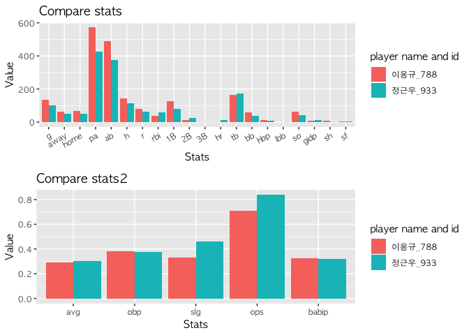
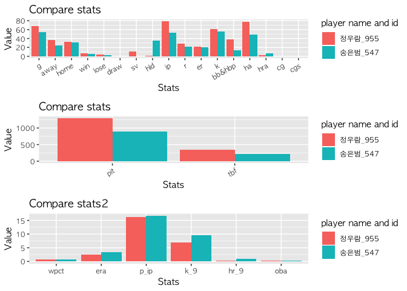
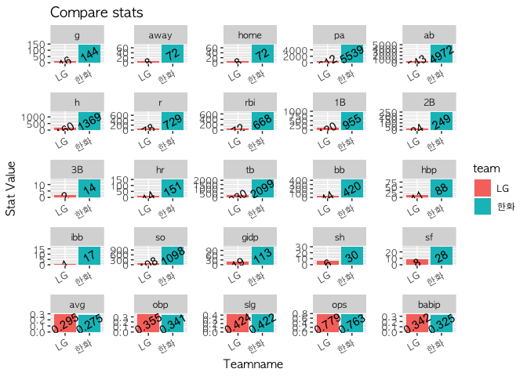
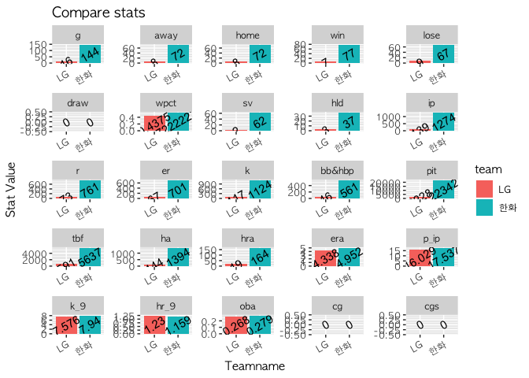

<!-- README.md is generated from README.Rmd. Please edit that file -->

# `kbodatamining`

## Package Introduction

The goal of `kbodatamining` package is analizing and visualizing korean
baseball data(KBO data). This package is intended to make use of KBO
data collected from Python to R.

## Package Installation

You can install package `kbodatamining` from github with the following
command.

``` r
# install.packages("devtools")
devtools::install_github("choosunsick/kbodatamining")
```

## Package Functionality

There are two primary functions in this package. The first is to make
the records of players box-score. for example:

``` r
library(kbodatamining)

# batter example
batter_boxscore(data = hanhwa_batter_2018,name = "이용규",yearly = 2018)
#>       name period team   g away home  pa  ab   h  r rbi  1B 2B 3B hr  tb
#> 788 이용규   2018 한화 134   65   69 575 491 144 82  36 128 14  1  1 163
#>     bb hbp ibb so gidp sh sf   avg   obp   slg   ops babip  id
#> 788 59  12   0 62    8  8  5 0.293 0.379 0.332 0.711 0.328 788
# pitcher example
pitcher_boxscore(data = hanhwa_pitcher_2018,name = "정우람",yearly = 2018)
#>     name period team  g away home win lose draw  wpct sv hld ip  r er  k
#> 1 정우람   2018 한화 55   24   31   5    3    0 0.625  0  35 53 22 20 56
#>   bb&hbp pit tbf ha hra   era   p_ip   k_9  hr_9   oba  id cg cgs
#> 1     14 888 220 49   6 3.396 16.755 9.509 1.019 0.245 955  0   0
# team hitting example
team_batter_boxscore(data = hanhwa_batter_2018,teamname = "한화",yearly = 2018)
#>   period team   g away home   pa   ab    h   r rbi  1B  2B 3B  hr   tb  bb
#> 1   2018 한화 144   72   72 5539 4972 1369 729 668 955 249 14 151 2099 420
#>   hbp ibb   so gidp sh sf   avg   obp   slg   ops babip
#> 1  88  17 1098  113 30 28 0.275 0.341 0.422 0.763 0.325
# team pitching example
team_pitcher_boxscore(data = hanhwa_pitcher_2018,teamname = "한화",yearly = 2018)
#>   period team   g away home win lose draw      wpct sv hld   ip   r  er
#> 1   2018 한화 144   72   72  77   67    0 0.5347222 62  37 1274 761 701
#>      k bb&hbp   pit  tbf   ha hra   era   p_ip  k_9  hr_9   oba cg cgs
#> 1 1124    561 22342 5637 1394 164 4.952 17.537 7.94 1.159 0.279  0   0
```

The second is to visualize monthly or seasonal comparisons for each
player. In addition, these two functions can be applied to each team.
for example:

``` r
library(kbodatamining)
theme_set(theme_gray(base_family = "AppleGothic"))
# comparing batters
oneseason_batter_compare(data = hanhwa_batter_2018,playername1 = "이용규",playername2 = "정근우",yearly=2018)
```

<!-- -->

``` r
# comparing pitchers
oneseason_pitcher_compare(data = hanhwa_pitcher_2018,playername1 = "정우람",playername2 = "송은범",yearly=2018)
```

<!-- -->

``` r
# comparing batters of team
compare_batter_statistic_teams(hanhwa_batter_2018,"한화","LG",yearly=2018)
```

<!-- -->

``` r
# comparing pitchers of team
compare_pitcher_statistic_teams(hanhwa_pitcher_2018,"한화","LG",yearly=2018)
```

<!-- -->

You can find a detailed explanation of this function in the ‘plotting
example’ document of the vignette folder.

## Notes on data

How to collect KBO data from Python can be found at
[LINK](https://choosunsick.github.io/post/kbo_data_wrangling/). For
reference, the sample data in the package includes the data of 2018
season Hanhwa team. This sample data is divided into
‘hanhwa\_batter\_2018’, ‘hanhwa\_pitcher\_2018’. You can check the
package’s functions using sample data.

## Json data processing (json data 처리과정)

If you see the link above and get a json file for the KBO game through
Python, you will have to process the json file to use it in R. So I’ll
show you an example of loading a json file from R and making it to
DATAFRAME. An example of the process will be shown through the data in
the json\_sample folder in this github. for example:

``` r
library(jsonlite)
library(kbodatamining)
# read json file
sample_set <- fromJSON("./json_sample/Hanhwa_normalseason_2018.json")
# make batter data dataframe 
# If you want pitch data, use json2pitcherdf instead of json2batterdf
hanhwa_batter_2018 <- do.call(rbind,lapply(names(sample_set),FUN = function(x)json2batterdf(sample_set,x)))
# organizing column order & column name
hanhwa_batter_2018 <- hanhwa_batter_2018[,c(18:21,11,16:17,1:9,24,23,22,13,12,10,15)]
colnames(hanhwa_batter_2018) <- c('date','away','home','doubleheader','name','team','position',
                                  'one','two','three','four','five','six','seven','eight','nine',
                                  'ten','eleven','twelve','ab','h','r','rbi')
head(hanhwa_batter_2018)
#>         date away home doubleheader   name team position  one  two three
#> 1 2018-03-24 한화 넥센            0 이용규 한화       중 2000 7003     0
#> 2 2018-03-24 한화 넥센            0 양성우 한화       좌 7006    0  7107
#> 3 2018-03-24 한화 넥센            0 송광민 한화       一 1017    0  1019
#> 4 2018-03-24 한화 넥센            0 김태균 한화       지 1011    0  1017
#> 5 2018-03-24 한화 넥센            0 이동훈 한화       주    0    0     0
#> 6 2018-03-24 한화 넥센            0 하주석 한화       유 1017    0  7005
#>   four five  six seven eight nine ten eleven twelve ab h r rbi
#> 1    0 7405    0  1019     0 2000   0      0      0  5 1 0   1
#> 2    0 1017    0  7002     0 7101   0      0      0  5 1 0   0
#> 3    0    0 2000     0  7003    0   0      0      0  4 2 1   0
#> 4    0    0 2000     0  1017    0   0      0      0  4 3 0   0
#> 5    0    0    0     0     0    0   0      0      0  0 0 0   0
#> 6    0    0 7003     0  7100    0   0      0      0  4 1 0   1
```

In addition, you need to create an id column of the players.

``` r
library("kbodatamining")
# read id list 
batter_id  <- read.csv("./player_id_list/batter_id_list.csv",stringsAsFactors = F)
# extract the appropriate id list for your data
batter_id_2018 <- batter_id[substr(batter_id$date,1,4)==2018,]
batter_id_hanhwa_2018 <- batter_id_2018[batter_id_2018$away=="한화"|batter_id_2018$home=="한화",]
# make id column 
hanhwa_batter_2018 <- get_player_id(hanhwa_batter_2018,batter_id_hanhwa_2018)
head(hanhwa_batter_2018)
#>            date away home doubleheader   name team position  one two three
#> 1350 2018-06-03 한화 롯데            0 강경학 한화       三    0   0     0
#> 1374 2018-06-05 한화   LG            0 강경학 한화       유    0   0     0
#> 1393 2018-06-06 한화   LG            0 강경학 한화       타    0   0     0
#> 1416 2018-06-07 한화   LG            0 강경학 한화       주    0   0     0
#> 1447 2018-06-08   SK 한화            0 강경학 한화       유 1300   0  1110
#> 1472 2018-06-09   SK 한화            0 강경학 한화       유 2000   0  1019
#>      four five  six seven eight nine ten eleven twelve ab h r rbi id
#> 1350    0    0    0     0     0    0   0      0      0  0 0 0   0  5
#> 1374    0    0    0  1019     0 1019   0      0      0  2 2 0   1  5
#> 1393    0    0    0     0     0    0   0      0      0  0 0 0   0  5
#> 1416    0    0    0     0     0    0   0      0      0  0 0 0   0  5
#> 1447 2000    0 1017     0  2000    0   0      0      0  5 3 2   2  5
#> 1472    0 7005    0     0  2000    0   0      0      0  4 1 0   0  5
```

Repeat the above process with your json file, changing only the year and
team name.
